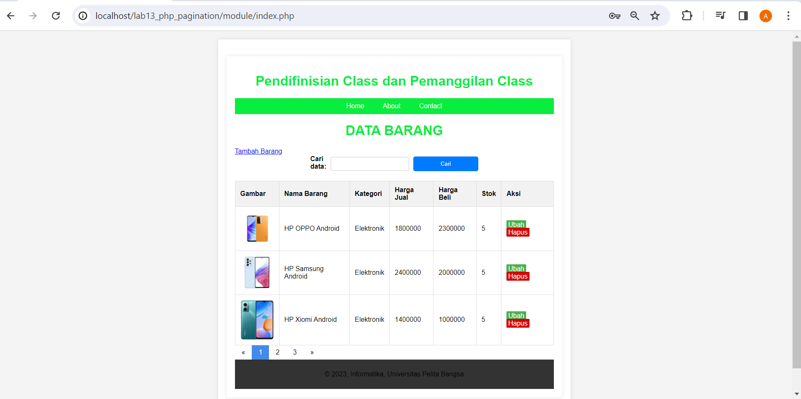

# Lab13Web

|  |  |  |
|-----|------|-----|
|Nama|Afrizal Fajrianto Anggara Sakti|
|NIM|312210449|
|Kelas|TI.22.A.4|
|Mata Kuliah|Pemograman Web|

## Membuat Pencarian Data dan Pagination

```php
 // Search query
    $q = "";
    $sql_where = "";
    if (isset($_GET['submit']) && !empty($_GET['q'])) {
        $q = $_GET['q'];
        $sql_where = " WHERE nama LIKE '{$q}%'";
    }


    // Pagination
    $sql = 'SELECT * FROM data_barang';

    $sql_count = "SELECT COUNT(*) FROM data_barang" . $sql_where;
    $result_count = mysqli_query($conn, $sql_count);

    $count = 0;

    if ($result_count) {
        $r_data = mysqli_fetch_row($result_count);
        $count = $r_data[0];
    }

    $per_page = 1;
    $num_page = ceil($count / $per_page);

    $limit = $per_page;

    if (isset($_GET['page'])) {
        $page = $_GET['page'];
        $offset = ($page - 1) * $per_page;
    } else {
        $offset = 0;
        $page = 1;
    }

    $sql .= $sql_where . " LIMIT {$offset}, {$limit}";
    $result = mysqli_query($conn, $sql);
```

Bagian kode ini melakukan hal berikut:

1. Memeriksa apakah formulir pencarian telah dikirimkan ( `isset($_GET["submit'])`) dan apakah permintaan pencarian tidak kosong ( `!empty($_GET['q'])`).
2. Jika ada permintaan pencarian, ia membuat klausa SQL WHERE untuk memfilter hasil berdasarkan permintaan pencarian. Pencarian dilakukan pada kolom "nama", "nim", dan "alamat" menggunakan operator LIKE.
3. Query SQL utama untuk memilih data dari tabel "mahasiswa" kemudian dimodifikasi untuk menyertakan klausa WHERE untuk pencarian.
4. Kode lainnya, termasuk penomoran halaman dan tampilan data, memperhitungkan parameter pencarian.

## Tampilan
